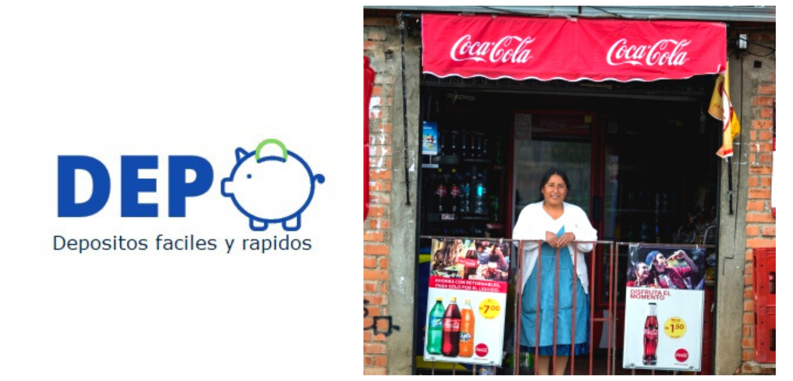

<!DOCTYPE HTML>
<html>
	<head>
		<title>DEPO</title>
		<meta charset="utf-8" />
		<meta name="viewport" content="width=device-width, initial-scale=1, user-scalable=no" />
		<link rel="stylesheet" href="assets/css/main.css" />
		<noscript><link rel="stylesheet" href="assets/css/noscript.css" /></noscript>
	</head>
	<body class="is-preload">

		<!-- Page Wrapper -->
			

				<!-- Header -->
					<header id="header">
						<h1><a href="index.html">DEPO</a></h1>
						<nav>
							<a href="#menu">Menu</a>
						</nav>
					</header>

				<!-- Menu -->
					<nav id="menu">
						

							<h2>Menu</h2>
							<ul class="links">
								<li><a href="index.html">Inicio</a></li>
								<li><a href="generic.html">Nuestra Startaup</a></li>
					
							</ul>
							<a href="#" class="close">Cerrar</a>
						

					</nav>

				<!-- Wrapper -->
					<section id="wrapper">
						<header>
							

								<h2>Acerca De Nosotros</h2>
								
Somos un proyecto Fintech.

							

						</header>

						<!-- Content -->
							

								

									<h3 class="major">Quienes Somos Nosotros</h3>
									
Somos uns fintech que facilita los depósitos en lugares donde no existen bancos mediante depósitos desde una app a través de tarjetas pre pago y códigos QR con alta seguridad, en cualquier punto.

									
Digitalizar tu dinero desde tu celular a la comodidad de tu casa en una plataforma donde concentra a todos los bancos en un mismo lugar. Además con métodos ya conocidos como las tarjetas pre pago para personas adultas y el código QR en la generación millennial y Z.

									
DEPO se puede encontrar en una tienda de barrio, farmacia, gasolinera, etc.

									<h3 class="major">La razón de ser y existir	</h3>
									
Nuestro objetivo es poder hacer que el proceso de depósito  de dinero sea más sencillo, desconcentrar las entidades financieras de esta manera y ayudar a la cultura de ahorro de las personas.

									
									<h3 class="major">Que nos diferencia</h3>

									

Deposita donde estés,  sin la necesidad de ir a un banco o tratar de encontrar un cajero(ATM).

									

Ahorra tiempo, ¿donde no hay una tienda de barrio?.

									

¡Seguridad y comodidad, ya no debes llevar de viaje a tu dinero!, depositar tu dinero nunca fue tan fácil.

									<section class="features">
										<article>
											
											<h3 class="major">ViSIÓN</h3>
											
Ser la solución definitiva del mercado financiero al momento de digitalizar el dinero físico de millones de usuarios, satisfaciendo sus necesidades de una forma segura.

											
										</article>
										<article>
											
											<h3 class="major">MISIÓN</h3>
											
Mejorar el acceso a la banca en lugares alejados, facilidad de uso de la aplicación facilitando los depósitos y fortalecer la economía a través del ahorro de las personas.

											
										</article>
									</section>

								

							

					</section>

				<!-- Footer -->
				<section id="footer">
					

						<h2 class="major">Contactanos</h2>
						
Deseas contactarte con nuestro equipo puedes buscarnos en nuestras redes sociales o enviarnos un mensaje por emdio del siguiente formulario.

						<form method="post" action="#">
							

								

									<label for="name">Nombre</label>
									<input type="text" name="name" id="name" />
								

								

									<label for="email">Correo</label>
									<input type="email" name="email" id="email" />
								

								

									<label for="message">Mensaje</label>
									<textarea name="message" id="message" rows="4"></textarea>
								

							

							<ul class="actions">
								<li><input type="submit" value="Enviar" /></li>
							</ul>
						</form>
						<ul class="contact">
							<li class="icon solid fa-home">
								Cochabamba - La Paz 
						
								Bolivia
							</li>
							<li class="icon solid fa-phone">(+591) 69518323</li>
							<li class="icon solid fa-envelope"><a href="#">yosoydepo@gmail.com</a></li>
							<li class="icon brands fa-twitter"><a href="#">twitter.com/yosoydepo</a></li>
							<li class="icon brands fa-facebook-f"><a href="#">DEPOSITOS (DEPO)</a></li>
							<li class="icon brands fa-instagram"><a href="#">instagram.com/yosoydepo</a></li>
						</ul>
						<ul class="copyright">
							<li>&copy; Todos los derechos reservados.</li>
						</ul>
					

				</section>

			

		<!-- Scripts -->
			
			
			
			
			
			

	</body>
</html>